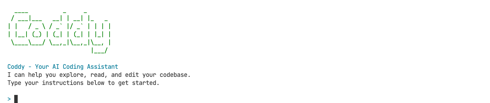

# Coddy

Minimal AI-powered CLI coding agent inspired by tools like Claude Code and Gemini CLI, built to demonstrate how agents work.



## Prerequisites

To use Coddy, you will need:

- [Node.js](https://nodejs.org/) (v20+)
- An API key for a Large Language Model (LLM)

## Installation

```bash
git clone git@github.com:yousoumar/coddy.git
cd coddy
```

## Usage

```bash
API_KEY=your_gemini_api_key node main.js
```

---

_Inspired by Mihail Eric’s “The Emperor Has No Clothes: How to Code Claude Code in 200 Lines of Code” article, and “Inside The Agent Loop with Pierce Boggan” podcast on Visual Studio Code YouTube Channel._
